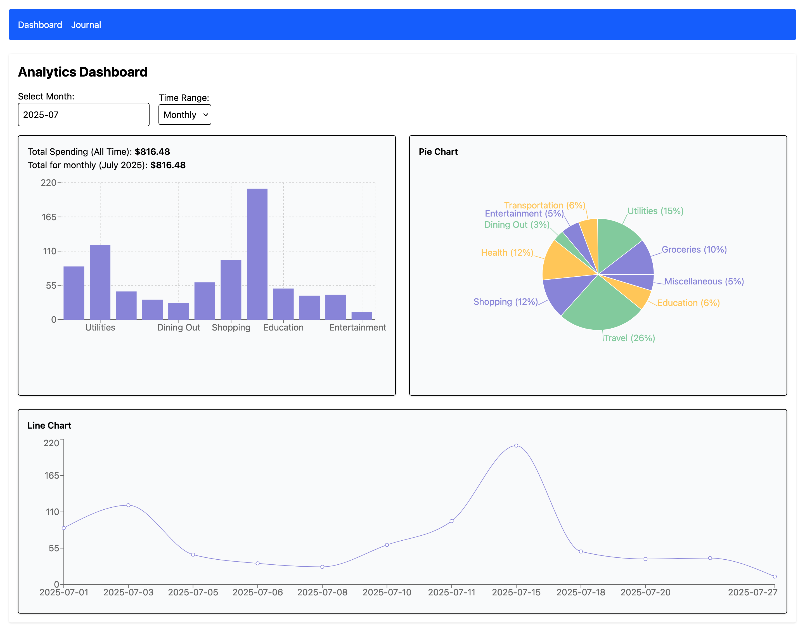
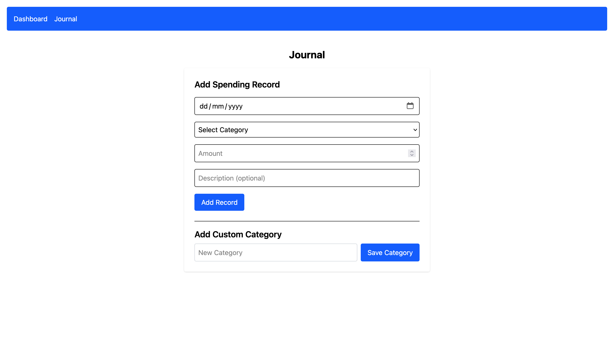

# 💸 Spending Tracker

A simple, modern personal finance tracking app built with **React**, **Vite**, and **Recharts**. Log your daily expenses, view and manage records, and visualize your spending habits with intuitive charts.

---

## 🥷🏼 Team Member

- Khine Khant (6611718)

---

## ✨ Features

- 📅 Date picking made easy with `react-datepicker`
- 🧾 Track expenses by category, date, and amount
- 📊 Visualizations using `recharts` (Pie & Line Charts)
- 📂 Multi-page navigation using `react-router-dom`
- 🧠 Stores data locally in the browser (no backend)
- ⚡ Fast build and reload times using `vite`
- 🗂️ Custom spending categories support

---




---

## 🛠 Tech Stack

| Tool                                             | Purpose                            |
| ------------------------------------------------ | ---------------------------------- |
| [React](https://reactjs.org/)                    | Frontend UI                        |
| [Vite](https://vitejs.dev/)                      | Fast bundler and dev server        |
| [react-router-dom](https://reactrouter.com/)     | Client-side routing                |
| [react-datepicker](https://reactdatepicker.com/) | Friendly date picker component     |
| [date-fns](https://date-fns.org/)                | Lightweight date utility functions |
| [Recharts](https://recharts.org/)                | Beautiful data visualizations      |

---

## 🚀 Getting Started

1. **Clone the repository**

```bash
git clone https://github.com/yourusername/spending-tracker.git
cd spending-tracker
```
